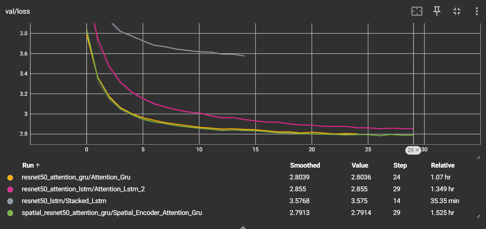
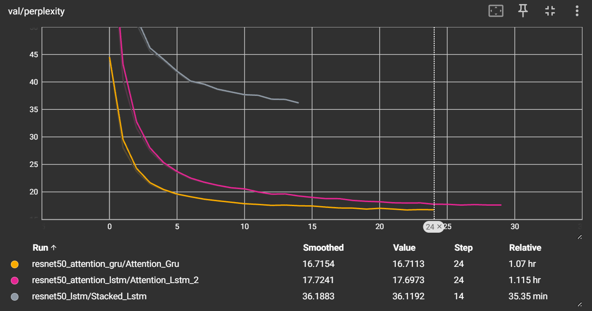
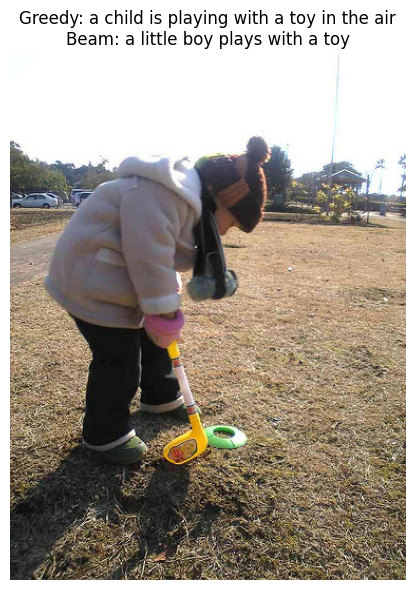
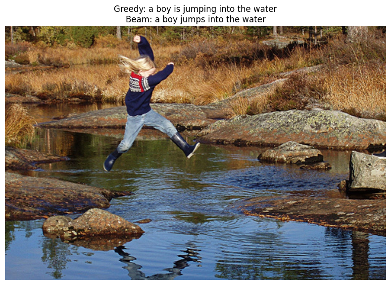

## Image Captioning with CNN RNN Architectures

This project explores image captioning using encoder decoder architectures based on a convolutional neural network for image feature extraction and recurrent neural networks for sequence generation. The goal is to compare a baseline stacked LSTM decoder with an attention based decoder and analyze their performance on a standard benchmark dataset.

### Approaches

Two different architectures were implemented and evaluated:

1. **ResNet50 + Stacked LSTM**
   - ResNet50 pretrained on ImageNet used as the image encoder
   - 3 layer stacked LSTM as the decoder
   - Embedding dimension of 512
   - LSTM hidden dimension of 512
   - Training metrics for this model were unfortunately lost

2. **ResNet50 + Attention + Stacked LSTM**
   - ResNet50 pretrained on ImageNet used as the image encoder
   - Soft attention mechanism over spatial image features
   - 3 layer stacked LSTM decoder
   - Word embedding dimension of 512
   - Attention dimension of 512
   - LSTM hidden dimension of 512

3. **ResNet50 + Attention + Stacked GRU**
   - ResNet50 pretrained on ImageNet used as the image encoder
   - Soft attention mechanism over spatial image features
   - 3 layer stacked GRU decoder
   - Word embedding dimension of 512
   - Attention dimension of 512
   - GRU hidden dimension of 512

### Dataset

The models were trained and evaluated on the **Flickr8k** dataset. Each image is paired with multiple human annotated captions. Standard train, validation, and test splits were used.

### Training Details

- Optimizer: Adam
- Loss function: Masked Cross Entropy Loss to properly ignore padding tokens
- Number of epochs: 30

Final training metrics for the attention based model:

| Split      | Loss  | Perplexity |
| ---------- | ----- | ---------- |
| Train      | 2.554 | 12.89      |
| Validation | 2.855 | 17.85      |

### Metrics Comparison

  

    
    
Loss Comparison

  

  

    
    
Perplexity Comparison

  

### Evaluation Results

The Lstm attention based model was evaluated using BLEU scores with both greedy decoding and beam search.

| Metric | Greedy Score | Beam Score (beam width of 5) |
| ------ | ------------ | ---------------------------- |
| BLEU 1 | 0.3166       | 0.3034                       |
| BLEU 2 | 0.1825       | 0.1772                       |
| BLEU 3 | 0.1092       | 0.1083                       |
| BLEU 4 | 0.0668       | 0.0671                       |

The GRU based model was also evaluated using BLEU scores with both greedy decoding and beam search.

| Metric | Greedy Score | Beam Score (beam width of 5) |
| ------ | ------------ | ---------------------------- |
| BLEU 1 | 0.3184       | 0.3014                       |
| BLEU 2 | 0.1792       | 0.1732                       |
| BLEU 3 | 0.1061       | 0.1050                       |
| BLEU 4 | 0.0637       | 0.0651

Beam search provided a slight improvement in higher order BLEU scores, while greedy decoding performed comparably on unigram precision. This behavior is consistent with common observations in image captioning models.

### Examples

  

    
    
Example 1

  

  

    
    
Example 2

  

### Future Work

Planned extensions for this project include:

- Exploring hybrid architectures combining LSTM and GRU layers
- Adding additional evaluation metrics such as CIDEr and METEOR
- Improving attention mechanisms or experimenting with transformer based decoders

### References

- [Image Captioning Deep Learning Model Using ResNet50 Encoder
  and Hybrid LSTM–GRU Decoder Optimized with Beam Search](https://www.tandfonline.com/doi/full/10.1080/00051144.2025.2485695)

- [Image Captioning: Transforming Objects into
  Words](https://proceedings.neurips.cc/paper_files/paper/2019/file/680390c55bbd9ce416d1d69a9ab4760d-Paper.pdf)
